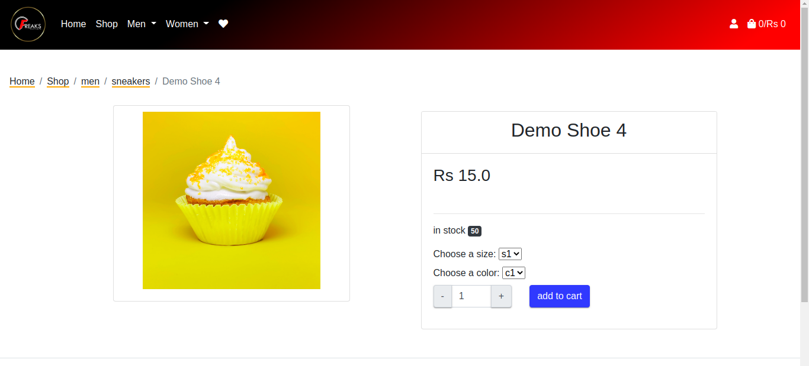
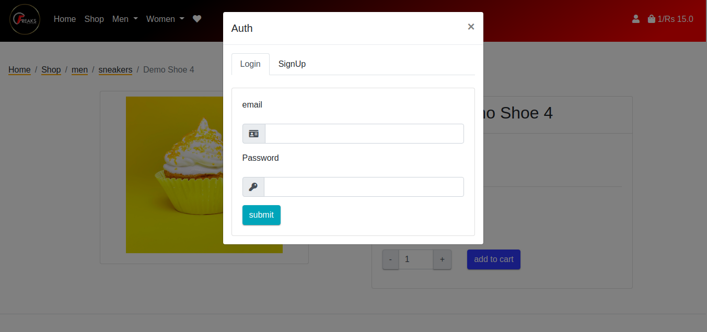

# ShopCube


Create a virtual environment and activate it

install requirements

```
pip install -r reqs/app.txt
pip install -r reqs/dev.txt
```


```
cd shopyo
python manage.py initialise
python manage.py rundebug
```
using shopyo/shopcube.db as db

browse around and go to /dashboard with login admin@domain.com and password pass

Current features:

-  cart
-  wishlist
-  stock
-  orders

Read the [shopyo](https://shopyo.readthedocs.io/en/latest/) docs to get more development insights

View a live demo of [ShopCube](http://shopcube.pythonanywhere.com/shop/home) deployed to [PythonAnywhere](http://pythonanywhere.com/).

## Config DB


In shopyo/ create a new folder called instance

In shopyo/instance/ create a new file called config.py


In config.py add something like that, the following is for mysql:

```python
SQLALCHEMY_DATABASE_URI = "mysql+pymysql://{username}:{password}@{server_name}/{db_name}".format(
    username='shopcube',
    password='pass1234-A',
    server_name='localhost',
    db_name='shopcube'
)
```
## 🍳 In Action




